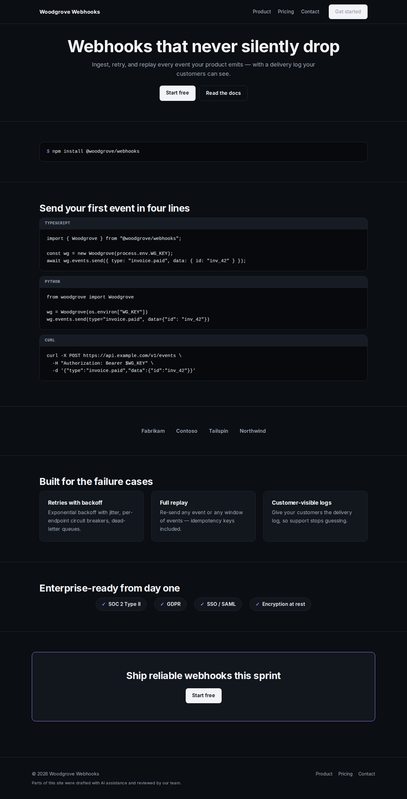

# t2d3-site-template-builder

**Builder** — a benchmark-derived B2B SaaS website starter template (technical trust × code-native dark).
A code-native dark site where the product demos itself in its own dialect — install line first, proof beside it.



One of five starter templates behind the [T2D3 OS](https://www.t2d3.pro) Website
Builder: the app turns a company's locked go-to-market foundation (ICP,
personas, value props, brand) into a complete site spec, and this template
renders it — the architecture is reviewed once, every build only fills
content. Derived from a benchmark study of 75 top sub-$100M-ARR SaaS sites:
patterns and roles, never any single site's copy or trade dress.

Canonical source: `site-templates/builder/` in the `t2d3-playbook-app` monorepo
(this repo is a read-only mirror, synced on release).

Identical architecture and section contract to `t2d3-site-template-utility`
(see its README for the fill-content flow) — this template differs in SKIN:
the dark-native neutral system (near-black canvas, dark surfaces, light ink),
light-fill primary buttons, prominent mono accents, and the code-first
signature moment (`code_block` terminal + tabs on the homepage).

## Run the sample

```bash
npm install
npm run dev
```
